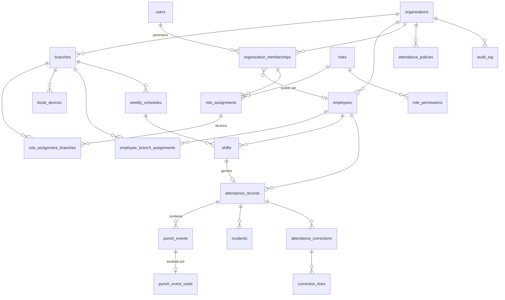

# 02 · Modelo de datos (PostgreSQL) — multi-negocio

> Borrador de diseño. Deriva de `01-reglas-de-negocio.md`. No es aún el DDL final: es el mapa de tablas, columnas clave y restricciones que lo gobernarán.
> Fatboy es simplemente el primer registro de `core.organizations`.

## 1. Convenciones

- **Claves primarias:** `uuid` (v7 si es posible). Sin enteros autoincrementales expuestos.
- **Tiempo:** instantes en `timestamptz` (UTC). Las fechas laborales son `date` calculadas en la zona de la sucursal.
- **Nada se borra:** FKs `ON DELETE RESTRICT`. El rol de BD de la aplicación **no tiene `DELETE`** sobre tablas de negocio.
- **Esquemas de Postgres por módulo:** `platform`, `auth`, `core`, `scheduling`, `attendance`, `audit` (y luego `tables`, `payroll`, …).
- **Extensiones:** `btree_gist` (exclusión de traslapes), `pgcrypto`.
- **Multi-tenant (regla de oro):** toda tabla de datos de negocio tiene `organization_id uuid NOT NULL`, `UNIQUE (organization_id, id)`, FKs **compuestas** hacia sus padres y **RLS forzado** (ver §3).
- **Tablas globales (sin `organization_id`, sin datos de negocio):** `core.permissions` (catálogo), `auth.users` (identidad), `platform.*`. Todo lo demás es por negocio.

## 2. Diagrama


*(Todas las entidades de negocio cuelgan de `organizations` mediante `organization_id`; solo se dibujó donde aporta claridad.)*

## 3. Aislamiento entre negocios (diseño)

Tres capas; la tercera es la que protege aunque haya un error de código:

### 3.1 Integridad referencial por negocio (FK compuestas)
```sql
-- En cada tabla padre de negocio
ALTER TABLE core.branches  ADD CONSTRAINT branches_org_id_uk  UNIQUE (organization_id, id);
ALTER TABLE core.employees ADD CONSTRAINT employees_org_id_uk UNIQUE (organization_id, id);

-- En los hijos: la FK incluye organization_id ⇒ imposible apuntar a otro negocio
ALTER TABLE scheduling.shifts
  ADD FOREIGN KEY (organization_id, employee_id) REFERENCES core.employees (organization_id, id),
  ADD FOREIGN KEY (organization_id, branch_id)   REFERENCES core.branches  (organization_id, id);
```
Un turno del negocio A **no puede** referenciar un empleado del negocio B ni por error ni por ataque.

### 3.2 Row-Level Security (RLS) forzado
```sql
-- Negocio activo de la transacción actual; sin valor => NULL => no coincide con nada
CREATE FUNCTION core.current_org() RETURNS uuid LANGUAGE sql STABLE AS
$$ SELECT nullif(current_setting('app.organization_id', true), '')::uuid $$;

-- Se aplica a TODA tabla de negocio (helper en cada migración)
ALTER TABLE scheduling.shifts ENABLE ROW LEVEL SECURITY;
ALTER TABLE scheduling.shifts FORCE  ROW LEVEL SECURITY;   -- aplica incluso al dueño de la tabla
CREATE POLICY tenant_isolation ON scheduling.shifts
  USING      (organization_id = core.current_org())
  WITH CHECK (organization_id = core.current_org());
```
- La API abre **cada transacción** con `SELECT set_config('app.organization_id', $1, true)` (equivalente a `SET LOCAL`): el valor muere al terminar la transacción, así que no "se filtra" entre peticiones del pool.
- `organization_id` del contexto sale **solo** de la sesión autenticada o del token del kiosco (nunca del request).
- `WITH CHECK` impide **insertar o mover** filas a otro negocio.

### 3.3 Roles de base de datos
| Rol | Uso | Privilegios |
|---|---|---|
| `migrator` | Migraciones (dueño de objetos) | DDL. Solo en el despliegue |
| `app_user` | La API | DML sin `DELETE` en negocio, sin `UPDATE` en tablas solo-agregar, **`NOBYPASSRLS`**, no superusuario |
| `platform_ops` | Scripts internos (alta de negocio, soporte) | `BYPASSRLS` limitado; credenciales fuera de la API; todo uso queda en `platform.platform_audit_log` |

### 3.4 Funciones de plataforma (únicas "puertas" sin contexto de negocio)
Necesarias porque algunas búsquedas ocurren **antes** de saber el negocio. Son `SECURITY DEFINER`, mínimas, de solo lectura y con `search_path` fijo:
- `auth.resolve_kiosk_token(token_prefix)` → `(device_id, organization_id, branch_id, token_hash, status)`. La API verifica el secreto y luego fija el contexto del negocio.
- `core.list_active_organizations()` → ids, para que los procesos programados iteren negocio por negocio, cada uno con su propio contexto.
- Login: `auth.users` es global; `core.organization_memberships` tiene además una política de **solo lectura** `user_id = current_setting('app.user_id')` para listar los negocios del usuario autenticado.

### 3.5 Garantía automática en CI
Una consulta de catálogo falla el pipeline si existe una tabla con `organization_id` que no tenga RLS habilitado **y** forzado y una política `tenant_isolation`; y otra falla si hay una tabla de negocio **sin** `organization_id` (salvo la lista blanca de tablas globales). Además hay pruebas de integración: con el contexto del negocio A, `SELECT`/`UPDATE`/`INSERT` sobre filas del negocio B deben devolver 0 filas o fallar, **para todas las tablas**.

## 4. Esquemas `platform` y `auth` (globales)

### `platform.platform_audit_log` (solo-agregar)
Operaciones de plataforma: alta/suspensión de negocio, soporte. `id`, `occurred_at`, `actor`, `action`, `organization_id` (nullable), `details` jsonb.

### `auth.users` (identidad global)
`id`, `email` (único, normalizado en minúsculas), `password_hash` (argon2id), `is_active`, `last_login_at`, `failed_attempts`, `locked_until`.
Una persona = una fila, **aunque** tenga acceso a muchas sucursales o a varios negocios **[D-19]**.

## 5. Esquema `core`

### `core.organizations` (el tenant)
`id` (= `organization_id` en todo el sistema), `slug` (único), `name`, `logo_url`/`branding` (jsonb), `default_timezone`, `status` (`ACTIVE`/`SUSPENDED`), `created_at`.
RLS: `id = core.current_org()` (más función de plataforma para listarlas).

### `core.branches`
`id`, **`organization_id`**, `code`, `name`, `timezone` (IANA, hereda de la organización), **`operational_cutoff_time` (time, default `05:00`)**, `is_active`.
`UNIQUE (organization_id, code)`, `UNIQUE (organization_id, id)`.

### `core.employees`
| Columna | Notas |
|---|---|
| `id`, **`organization_id`** | |
| `employee_number` | `UNIQUE (organization_id, employee_number)` |
| `first_name`, `last_name`, `phone`, `notes` | |
| `status` | `ACTIVE` / `INACTIVE` |
| `hired_at`, `terminated_at`, `termination_reason` | La baja no borra nada |
| `pin_hmac` | `HMAC-SHA256(PEPPER, organization_id ‖ ':' ‖ pin)`. **Nunca el PIN.** `NULL` al dar de baja |
| `pin_set_at` | |

```sql
CREATE UNIQUE INDEX employees_pin_unique ON core.employees (organization_id, pin_hmac)
  WHERE status = 'ACTIVE' AND pin_hmac IS NOT NULL;   -- único POR NEGOCIO
```
> El *pepper* vive fuera de la BD. Al incluir `organization_id` en el HMAC, el mismo PIN en dos negocios produce hashes distintos (no se puede correlacionar). Con 6 dígitos hay solo 1 millón de combinaciones: sin pepper un volcado de BD se rompería en segundos.

### `core.employee_branch_assignments`
`id`, **`organization_id`**, `employee_id`, `branch_id`, `kind` (`PRIMARY`/`TEMPORARY`), `valid_from`, `valid_to`, `reason`, `created_by`. FKs compuestas (empleado y sucursal **del mismo negocio**).
```sql
ALTER TABLE core.employee_branch_assignments ADD CONSTRAINT one_primary_at_a_time
  EXCLUDE USING gist (employee_id WITH =, daterange(valid_from, valid_to, '[]') WITH &&)
  WHERE (kind = 'PRIMARY');
```

### Usuarios, membresías y alcance
- **`core.organization_memberships`**: `id`, **`organization_id`**, `user_id` → `auth.users`, `employee_id` (nullable; si la persona también checa), `status`. `UNIQUE (organization_id, user_id)`.
- **`core.roles`**: `id`, **`organization_id`**, `name`, `is_system`. Al crear el negocio se siembran `ADMIN` y `ENCARGADO` (cada negocio puede crear roles propios).
- **`core.permissions`** *(global)*: `code` PK, `description`. Ej.: `attendance.view`, `attendance.correction.apply`, `attendance.correction.request`, `schedules.manage`, `employees.manage`, `employees.pin.manage`, `incidents.resolve`, `reports.export`, `audit.view`, `settings.manage`, `kiosks.manage`, `roles.manage`.
- **`core.role_permissions`**: `organization_id`, `role_id`, `permission_code`.
- **`core.role_assignments`**: `id`, **`organization_id`**, `membership_id`, `role_id`, `scope` (`ORGANIZATION` = todas las sucursales / `BRANCHES` = lista).
- **`core.role_assignment_branches`**: `organization_id`, `assignment_id`, `branch_id`. FKs compuestas.

Así **un usuario con varias sucursales = una cuenta, una membresía, una asignación de rol con varias filas en `role_assignment_branches`**. Sin duplicar cuenta. Un dueño = rol `ADMIN` con `scope = ORGANIZATION`.

### `core.kiosk_devices` y emparejamiento
- `kiosk_devices`: `id`, **`organization_id`**, `branch_id`, `name`, `token_prefix` (único global, identificador público), `token_hash` (el secreto **hasheado**), `status` (`ACTIVE`/`REVOKED`), `last_seen_at`, `revoked_at`. El token **está ligado a negocio y sucursal**: no sirve para ningún otro.
- `kiosk_pairing_codes`: `id`, **`organization_id`**, `branch_id`, `code_hash`, `expires_at`, `used_at`, `created_by`. Código de un solo uso con vencimiento corto para vincular la tablet.

### `core.pin_attempts` (seguridad)
`id`, **`organization_id`**, `kiosk_device_id`, `attempted_at`, `success`, `employee_id` (null si falló).

### `core.attendance_policies` (configuración en cascada)
Una fila por *nivel*: `scope` (`ORGANIZATION`/`BRANCH`/`EMPLOYEE`), **`organization_id`**, `branch_id`, `employee_id`, y **una columna tipada por parámetro** (`tolerance_in_min`, `tolerance_out_min`, `late_counts_as_absence_min`, `absent_threshold_min`, `early_entry_window_min`, **`break_allowed_min` (default 35)**, `break_tolerance_min`, `max_breaks`, `require_break`, `max_hours_unscheduled`, …), todas nullable salvo en el nivel `ORGANIZATION`. `NULL` = hereda.
```sql
CREATE UNIQUE INDEX pol_org  ON core.attendance_policies (organization_id) WHERE scope = 'ORGANIZATION';
CREATE UNIQUE INDEX pol_br   ON core.attendance_policies (organization_id, branch_id)   WHERE scope = 'BRANCH';
CREATE UNIQUE INDEX pol_emp  ON core.attendance_policies (organization_id, employee_id) WHERE scope = 'EMPLOYEE';
```
Resolución: `EMPLOYEE → BRANCH → ORGANIZATION`, campo por campo (`COALESCE`), en una función del dominio con pruebas. Ejemplo: `break_allowed_min = 35` a nivel negocio; 40 para la sucursal "Américas"; 45 para un empleado específico con excepción.
Para ajustes menores existe `core.app_settings(organization_id, key, value jsonb)`.
> `hora_corte_operativo` y `timezone` viven en `core.branches` (son atributos de la sucursal, no políticas heredables).

## 6. Esquema `scheduling`

Todas con **`organization_id`** y FKs compuestas.

- **`shift_templates`**: `id`, `organization_id`, `branch_id` (null = todo el negocio), `name`, `start_time`, `end_time`, `is_active`.
- **`weekly_schedules`**: `id`, `organization_id`, `branch_id`, `week_start`, `status` (`DRAFT`/`PUBLISHED`), `published_at`, `published_by`. `UNIQUE (organization_id, branch_id, week_start)`.
- **`shifts`**: `id`, `organization_id`, `schedule_id`, `employee_id`, `branch_id`, `business_date`, `start_local`, `end_local`, `starts_at`, `ends_at` (timestamptz calculados con la zona de la sucursal; si `end_local <= start_local`, `ends_at` cae al día siguiente), `template_id`, `status` (`SCHEDULED`/`CANCELLED`).

```sql
ALTER TABLE scheduling.shifts ADD CONSTRAINT no_overlap
  EXCLUDE USING gist (employee_id WITH =, tstzrange(starts_at, ends_at, '[)') WITH &&)
  WHERE (status = 'SCHEDULED');
ALTER TABLE scheduling.shifts ADD CONSTRAINT valid_range CHECK (ends_at > starts_at);
```
Índices: `(organization_id, branch_id, business_date)`, `(organization_id, employee_id, business_date)`, `(organization_id, branch_id, starts_at, ends_at)`.

## 7. Esquema `attendance` (el corazón)

Todas con **`organization_id`**, FKs compuestas y RLS.

### `attendance_records` — la jornada
Proyección **recalculable** a partir de checadas efectivas + turno + política.

| Columna | Notas |
|---|---|
| `id`, `organization_id`, `employee_id`, `branch_id` | `branch_id` = donde se trabajó |
| `shift_id` | Nullable (checada sin turno) |
| `business_date` | Con turno: la del turno. Sin turno: la del **día operativo** de la Entrada |
| `state` | `OPEN_WORKING` / `OPEN_BREAK` / `CLOSED` / `NEEDS_REVIEW` / `ABSENT` |
| `scheduled_start`, `scheduled_end` | Snapshot del turno |
| `review_due_at` | Instante en que, si sigue abierta, se marca como olvido de salida (primer corte operativo posterior al fin programado; ver RN-OPE-04). Recalculado si cambia el turno |
| `actual_in`, `actual_out` | `actual_out` queda **vacío** si nadie registró salida; **nunca se inventa** |
| `entry_delta_minutes` | Con signo: `actual_in − scheduled_start`. **Siempre se guarda** |
| `entry_status` | `ON_TIME` / `LATE` / `NONE` |
| `late_minutes` | = `entry_delta_minutes` solo si `LATE`; si no, 0 |
| `exit_status`, `early_leave_minutes` | `NORMAL`/`EARLY`/`MISSING` |
| `scheduled_minutes` | |
| `worked_minutes` | `actual_out − actual_in`, sin descontar comida. **`NULL` si incompleta** |
| `break_minutes`, `break_exceeded_minutes` | Informativos |
| `policy_snapshot` | `jsonb` con los parámetros usados (RN-CAL-05) |
| `computed_at`, `version` | |

```sql
CREATE UNIQUE INDEX one_open_record ON attendance.attendance_records (employee_id)
  WHERE state IN ('OPEN_WORKING','OPEN_BREAK');
CREATE UNIQUE INDEX one_record_per_shift ON attendance.attendance_records (shift_id) WHERE shift_id IS NOT NULL;
CREATE INDEX review_due ON attendance.attendance_records (review_due_at) WHERE state IN ('OPEN_WORKING','OPEN_BREAK');
```
Índices: `(organization_id, branch_id, business_date)`, `(organization_id, employee_id, business_date)`.

### `punch_events` — checadas (INMUTABLES)
`id`, `organization_id`, `attendance_record_id`, `employee_id`, `branch_id`, `type` (`IN`/`OUT`/`BREAK_START`/`BREAK_END`), `occurred_at` (**hora del servidor**), `recorded_at`, `source` (`KIOSK`/`CORRECTION`), `kiosk_device_id`, `correction_id`, `client_event_id` (`UNIQUE (organization_id, client_event_id)`).

```sql
CREATE FUNCTION attendance.forbid_mutation() RETURNS trigger AS $$
BEGIN RAISE EXCEPTION 'La tabla % es solo-agregar', TG_TABLE_NAME; END; $$ LANGUAGE plpgsql;

CREATE TRIGGER punch_events_immutable
  BEFORE UPDATE OR DELETE ON attendance.punch_events
  FOR EACH ROW EXECUTE FUNCTION attendance.forbid_mutation();
-- y: REVOKE UPDATE, DELETE ON attendance.punch_events FROM app_user;
```
Mismo patrón para `punch_event_voids`, `correction_lines` y `audit.audit_log`. `attendance_corrections` solo permite cambiar su estado/decisión, nunca el motivo ni quién la solicitó.

### `punch_event_voids`
`organization_id`, `event_id` (PK), `correction_id`, `voided_at`. Anular = insertar aquí; la original **no se toca**.
```sql
CREATE VIEW attendance.effective_punch_events WITH (security_invoker = true) AS
SELECT e.* FROM attendance.punch_events e
LEFT JOIN attendance.punch_event_voids v ON v.event_id = e.id
WHERE v.event_id IS NULL;
```
`security_invoker = true` hace que la vista **respete el RLS** del usuario que consulta.

### `attendance_corrections` y `correction_lines`
Cabecera: `id`, `organization_id`, `attendance_record_id`, `status` (`PENDING`/`APPLIED`/`REJECTED`), `reason` (**NOT NULL**), `requested_by`, `requested_at`, `decided_by`, `decided_at`, `decision_note`.
Líneas: `id`, `organization_id`, `correction_id`, `action` (`ADD`/`VOID`), `target_event_id`, `event_type`, `new_occurred_at`, `old_occurred_at`.
Aplicar (una transacción): inserta checadas nuevas (`source=CORRECTION`), inserta anulaciones, valida la secuencia, recalcula la jornada, resuelve incidencias y escribe auditoría. Reglas de autorización (alcance del encargado, **no corregir la propia jornada**) se validan en el backend con pruebas; el aislamiento entre negocios lo garantiza el RLS.

### `incidents`
`id`, `organization_id`, `attendance_record_id`, `employee_id`, `branch_id`, `business_date`, `type`, `status` (`OPEN`/`RESOLVED`), `resolution` (`CORRECTED`/`JUSTIFIED`/`CONFIRMED`/`DISMISSED`), `detected_at`, `detected_by`, `resolved_by`, `resolved_at`, `resolution_note`, `correction_id`, `details` jsonb.
`UNIQUE (attendance_record_id, type)` evita duplicar al recalcular. `type` incluye `SIN_TURNO` (mostrado como "Sin turno programado"), `SIN_ASIGNACION_SUCURSAL`, `SALIDA_FALTANTE`, etc.

## 8. Esquema `audit`

### `audit.audit_log` (solo-agregar, por negocio)
`id` (bigint identity), **`organization_id` NOT NULL**, **`branch_id`** (nullable: solo cuando la acción pertenece a una sucursal), `occurred_at`, `actor_type` (`USER`/`SYSTEM`/`KIOSK`), `actor_user_id`, `action` (`shift.update`, `correction.apply`, `employee.deactivate`, `role.scope.change`, …), `entity_type`, `entity_id`, `before` jsonb, `after` jsonb, `reason`, `ip`, `request_id`.

- RLS por negocio: cada negocio solo ve su auditoría; `INSERT` solo con su contexto.
- Se inserta **en la misma transacción** del cambio auditado.
- Trigger `forbid_mutation` + `REVOKE UPDATE, DELETE`.
- Particionable por mes. *(Mejora futura: cadena de hashes anti-manipulación.)*
- Índices: `(organization_id, occurred_at)`, `(organization_id, entity_type, entity_id)`, `(organization_id, branch_id, occurred_at)`, `(organization_id, actor_user_id, occurred_at)`.

## 9. Cómo responde el modelo a los casos difíciles

| Caso | Cómo se resuelve |
|---|---|
| **Fuga entre negocios** (bug de código, consulta olvidada) | RLS forzado: sin contexto o con otro negocio, 0 filas. FKs compuestas impiden relaciones cruzadas. CI verifica que no falte RLS |
| **Turno 7 PM → 3 AM** | Turno guarda `starts_at`/`ends_at` reales. La Salida se agrega a la jornada abierta; `business_date` = día de inicio |
| **Olvidó salida** | `review_due_at` (primer corte posterior al fin del turno) ⇒ job marca `NEEDS_REVIEW`, `actual_out` vacío, incidencia `SALIDA_FALTANTE`. El encargado corrige agregando la salida; nada se inventa |
| **Jornada que cruza medianoche en sucursal con otro horario** | Cada sucursal con su `operational_cutoff_time` y zona horaria |
| **Checada sin turno (error administrativo)** | Se permite; jornada con `shift_id NULL` + incidencia `SIN_TURNO` |
| **Retardo 7:12 vs turno 7:00, tolerancia 10** | `entry_delta_minutes = 12`, `entry_status = LATE`, `late_minutes = 12`, incidencia. A las 7:08: delta 8, `ON_TIME`, sin incidencia |
| **Usuario con acceso a 2 sucursales** | Una cuenta, una membresía, una asignación `BRANCHES` con 2 filas |
| **Misma persona en dos negocios** | Una fila en `auth.users`, dos membresías; opera en uno a la vez |
| **Empleado prestado a otra sucursal** | Asignación `TEMPORARY`; `attendance_records.branch_id` = donde trabajó |
| **Doble toque** | Índice de jornada abierta + bloqueo + antirrebote + `client_event_id` único |
| **Corregir hora** | `VOID` + `ADD` en una corrección con motivo; ambas versiones existen para siempre |
| **Cambio de tolerancia** | Jornadas viejas conservan su `policy_snapshot` |
| **Baja de empleado** | `INACTIVE`, `pin_hmac = NULL`, historial intacto por `RESTRICT` |
| **Excepción de comida de un empleado** | Fila `EMPLOYEE` en `attendance_policies` con `break_allowed_min` |

## 10. Procesos programados (jobs)

Corren cada minuto con candado de Postgres. Para cada negocio devuelto por `core.list_active_organizations()` abren **una transacción con su contexto** (RLS activo) y ejecutan:
1. Jornadas abiertas con `review_due_at <= now()` ⇒ `NEEDS_REVIEW` + incidencia `SALIDA_FALTANTE`.
2. Turnos terminados sin jornada ⇒ crear jornada `ABSENT` + incidencia `FALTA`.
3. Comidas abiertas excesivas ⇒ incidencia `REGRESO_COMIDA_FALTANTE`.

## 11. Estimación de volumen

~50 empleados × 2–4 checadas/día ≈ 70 mil filas/año en `punch_events` **por negocio pequeño**. Con decenas de negocios sigue siendo manejable en una sola base con los índices propuestos (todos empiezan por `organization_id`). Si un negocio llegara a ser muy grande, el diseño permite moverlo a su propia base de datos sin cambiar el modelo.
