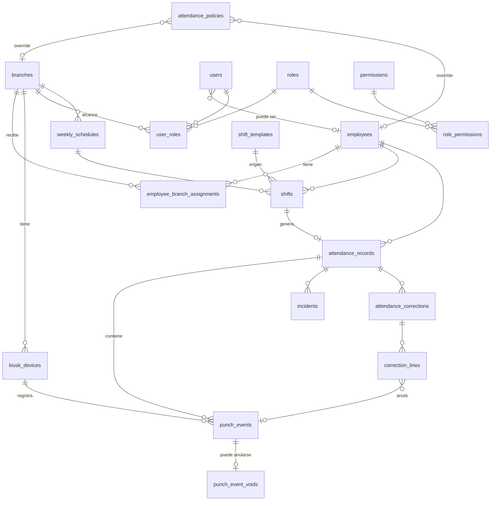

# 02 · Modelo de datos (PostgreSQL)

> Borrador de diseño. Deriva directamente de `01-reglas-de-negocio.md`. Aún no es el DDL final: es el mapa de tablas, columnas clave y restricciones que lo van a gobernar.

## 1. Convenciones

- **Claves primarias:** `uuid` (v7 si es posible, ordenable por tiempo). Sin enteros autoincrementales expuestos.
- **Tiempo:** todos los instantes en `timestamptz` (UTC). Las "fechas laborales" son `date` calculadas en la zona de la sucursal.
- **Nada se borra:** todas las FK son `ON DELETE RESTRICT`. El rol de BD que usa la API **no tiene `DELETE`** sobre tablas de negocio.
- **Estados** como `enum` de Postgres o `text` + `CHECK`. Los cambios de catálogo se hacen por migración.
- **Esquemas de Postgres por módulo** para que el sistema crezca ordenado: `core`, `scheduling`, `attendance`, `audit` (y luego `tables`, `payroll`, etc.).
- **Extensiones:** `btree_gist` (exclusión de traslapes), `pgcrypto`/`uuid-ossp` si hace falta.
- Todas las tablas mutables llevan `created_at`, `updated_at`; las de negocio, `created_by` cuando aplica.

## 2. Diagrama



## 3. Esquema `core`

### `branches`
`id`, `code` (único), `name`, `timezone` (IANA, ej. `America/Mexico_City`), `is_active`.

### `employees`
| Columna | Notas |
|---|---|
| `id` | |
| `employee_number` | Número de empleado, único. |
| `first_name`, `last_name`, `phone`, `notes` | |
| `status` | `ACTIVE` / `INACTIVE` |
| `hired_at`, `terminated_at`, `termination_reason` | La baja no borra nada. |
| `pin_hmac` | `HMAC-SHA256(pin, PEPPER)` en hex. **Nunca el PIN.** Se pone en `NULL` al dar de baja. |
| `pin_set_at` | Para saber cuándo se reinició. |

Restricción clave: PIN único entre activos.
```sql
CREATE UNIQUE INDEX employees_pin_unique ON core.employees (pin_hmac)
  WHERE status = 'ACTIVE' AND pin_hmac IS NOT NULL;
```
> El HMAC con "pepper" (secreto del servidor, fuera de la BD) permite buscar por PIN directamente y evita que un volcado de la BD revele los PINs (un PIN de 6 dígitos tiene solo 1,000,000 de combinaciones: sin pepper se romperían en segundos).

### `employee_branch_assignments`
`id`, `employee_id`, `branch_id`, `kind` (`PRIMARY`/`TEMPORARY`), `valid_from` (date), `valid_to` (date, `NULL` = indefinida), `reason`, `created_by`.

Restricciones:
```sql
-- Solo una asignación PRIMARY vigente a la vez por empleado
ALTER TABLE core.employee_branch_assignments ADD CONSTRAINT one_primary_at_a_time
  EXCLUDE USING gist (employee_id WITH =, daterange(valid_from, valid_to, '[]') WITH &&)
  WHERE (kind = 'PRIMARY');
```

### `users`
`id`, `email` (único), `password_hash` (argon2id), `employee_id` (nullable, FK), `is_active`, `last_login_at`.
Solo para el panel web (administradores, encargados). Los empleados **no** tienen fila aquí.

### RBAC
- `permissions(code PK, description)` — catálogo sembrado por migración. Ej.: `attendance.view`, `attendance.correction.apply`, `attendance.correction.request`, `schedules.manage`, `employees.manage`, `incidents.resolve`, `reports.export`, `audit.view`, `settings.manage`, `kiosks.manage`, `roles.manage`.
- `roles(id, name, description, is_system)`
- `role_permissions(role_id, permission_code)`
- `user_roles(id, user_id, role_id, branch_id NULL)` — `branch_id NULL` ⇒ alcance **todas las sucursales**; con valor ⇒ solo esa sucursal.

Roles iniciales sembrados: `ADMIN`, `ENCARGADO`. "Encargado que puede programar" = otro rol (o `ENCARGADO` + permiso), sin código nuevo.

### `kiosk_devices`
`id`, `branch_id`, `name`, `token_hash` (el token del dispositivo se guarda hasheado), `is_active`, `last_seen_at`, `revoked_at`.

### `pin_attempts` (seguridad)
`id`, `kiosk_device_id`, `attempted_at`, `success` (bool), `employee_id` (null si falló). Alimenta el bloqueo por intentos y la revisión de abusos.

## 4. Esquema `scheduling`

### `shift_templates`
`id`, `branch_id` (null = global), `name`, `start_time` (time), `end_time` (time), `is_active`. "Cruza medianoche" se deduce: `end_time <= start_time`.

### `weekly_schedules`
`id`, `branch_id`, `week_start` (date), `status` (`DRAFT`/`PUBLISHED`), `published_at`, `published_by`. `UNIQUE (branch_id, week_start)`.

### `shifts`
| Columna | Notas |
|---|---|
| `id`, `schedule_id`, `employee_id`, `branch_id` | |
| `business_date` | Fecha local de **inicio**. Ancla de reportes. |
| `start_local`, `end_local` | Hora local capturada (time). Informativo/edición. |
| `starts_at`, `ends_at` | `timestamptz` **calculados** con la zona de la sucursal. Si `end_local <= start_local`, `ends_at` cae al día siguiente. |
| `template_id` | Opcional. |
| `status` | `SCHEDULED` / `CANCELLED` |

```sql
-- Sin turnos traslapados por empleado
ALTER TABLE scheduling.shifts ADD CONSTRAINT no_overlap
  EXCLUDE USING gist (employee_id WITH =, tstzrange(starts_at, ends_at, '[)') WITH &&)
  WHERE (status = 'SCHEDULED');
ALTER TABLE scheduling.shifts ADD CONSTRAINT valid_range CHECK (ends_at > starts_at);
```
Índices: `(branch_id, business_date)`, `(employee_id, business_date)`, `(branch_id, starts_at, ends_at)` para el tablero en vivo.

## 5. Esquema `attendance` (el corazón)

### `attendance_records` — la jornada
Una fila por turno trabajado (o ausente). Es una **proyección recalculable** a partir de las checadas efectivas, el turno y la política.

| Columna | Notas |
|---|---|
| `id`, `employee_id`, `branch_id` (donde se trabajó) | |
| `shift_id` | Nullable (checada sin turno). |
| `business_date` | Fecha laboral. Si hay turno, la del turno; si no, la local de la Entrada. |
| `state` | `OPEN_WORKING` / `OPEN_BREAK` / `CLOSED` / `NEEDS_REVIEW` / `ABSENT` |
| `scheduled_start`, `scheduled_end` | Copia (snapshot) del turno. |
| `actual_in`, `actual_out` | Primera Entrada / última Salida efectivas. |
| `entry_status` | `ON_TIME` / `LATE` / `NONE` |
| `exit_status` | `NORMAL` / `EARLY` / `MISSING` |
| `late_minutes`, `early_leave_minutes` | |
| `scheduled_minutes`, `worked_minutes` (= salida − entrada, sin descontar comida), `break_minutes` (duración total de comida, informativa), `break_exceeded_minutes` | |
| `policy_snapshot` | `jsonb` con los parámetros usados al calcular (RN-CAL-05). |
| `computed_at`, `version` | Para control de concurrencia y reprocesos. |

```sql
-- A lo más una jornada abierta por empleado (RN-EVT-04)
CREATE UNIQUE INDEX one_open_record ON attendance.attendance_records (employee_id)
  WHERE state IN ('OPEN_WORKING','OPEN_BREAK');
-- Un turno genera a lo más una jornada
CREATE UNIQUE INDEX one_record_per_shift ON attendance.attendance_records (shift_id)
  WHERE shift_id IS NOT NULL;
```
Índices: `(branch_id, business_date)`, `(employee_id, business_date)`.

### `punch_events` — checadas (INMUTABLES)
| Columna | Notas |
|---|---|
| `id`, `attendance_record_id`, `employee_id`, `branch_id` | |
| `type` | `IN` / `OUT` / `BREAK_START` / `BREAK_END` |
| `occurred_at` | **Hora del servidor** (`timestamptz`). Para eventos de corrección, la hora que se está asentando. |
| `recorded_at` | Cuándo se insertó la fila (siempre `now()` del servidor). |
| `source` | `KIOSK` / `CORRECTION` |
| `kiosk_device_id` | Nulo si `source = CORRECTION`. |
| `correction_id` | Nulo si vino del kiosco. |
| `client_event_id` | `uuid` de idempotencia, `UNIQUE`. |

Inmutabilidad reforzada **en la base de datos**:
```sql
CREATE FUNCTION attendance.forbid_mutation() RETURNS trigger AS $$
BEGIN RAISE EXCEPTION 'La tabla % es solo-agregar', TG_TABLE_NAME; END; $$ LANGUAGE plpgsql;

CREATE TRIGGER punch_events_immutable
  BEFORE UPDATE OR DELETE ON attendance.punch_events
  FOR EACH ROW EXECUTE FUNCTION attendance.forbid_mutation();
-- Y además: REVOKE UPDATE, DELETE ON attendance.punch_events FROM app_user;
```
(Mismo patrón para `punch_event_voids`, `correction_lines` y `audit.audit_log`. `attendance_corrections` solo permite cambiar su `status`/decisión, nunca el motivo ni quién la solicitó.)

### `punch_event_voids`
`event_id` (PK, FK a `punch_events`), `correction_id`, `voided_at`. Anular = insertar aquí; la checada original **no se toca**.

Vista de lectura:
```sql
CREATE VIEW attendance.effective_punch_events AS
SELECT e.* FROM attendance.punch_events e
LEFT JOIN attendance.punch_event_voids v ON v.event_id = e.id
WHERE v.event_id IS NULL;
```
Todo cálculo usa `effective_punch_events`.

### `attendance_corrections` y `correction_lines`
Cabecera: `id`, `attendance_record_id`, `status` (`PENDING`/`APPLIED`/`REJECTED`), `reason` (**NOT NULL**), `requested_by`, `requested_at`, `decided_by`, `decided_at`, `decision_note`.
Líneas: `id`, `correction_id`, `action` (`ADD`/`VOID`), `target_event_id` (para `VOID`), `event_type` y `new_occurred_at` (para `ADD`), `old_occurred_at` (para trazabilidad).

Un cambio de hora = una línea `VOID` + una línea `ADD` en la misma corrección. Aplicar una corrección (en una transacción): inserta los `punch_events` nuevos (`source=CORRECTION`), inserta en `punch_event_voids`, valida la secuencia resultante (RN-COR-06), recalcula la jornada, resuelve incidencias y escribe auditoría.

### `incidents`
`id`, `attendance_record_id` (nullable), `employee_id`, `branch_id`, `business_date`, `type`, `status` (`OPEN`/`RESOLVED`), `resolution` (`CORRECTED`/`JUSTIFIED`/`CONFIRMED`/`DISMISSED`), `detected_at`, `detected_by` (`SYSTEM`), `resolved_by`, `resolved_at`, `resolution_note`, `correction_id`, `details` (jsonb, ej. minutos de retardo).
`UNIQUE (attendance_record_id, type)` para evitar duplicar la misma incidencia al recalcular.

## 6. Configuración

### `attendance_policies`
Una fila por *nivel*: `scope` (`GLOBAL`/`BRANCH`/`EMPLOYEE`), `branch_id`, `employee_id`, y **una columna tipada por parámetro** (`tolerance_in_min`, `tolerance_out_min`, `break_allowed_min`, `break_tolerance_min`, `max_breaks`, `unscheduled_punch` …), todas nullable salvo en `GLOBAL`. `NULL` = hereda. Validación con `CHECK` y esquema compartido en código.

Se eligieron **columnas tipadas** (y no clave/valor libre) porque son el núcleo del negocio: hay tipos, rangos y migraciones claras. Para ajustes menores y extensibles (ej. texto del kiosco) existe `core.app_settings(key, value jsonb)`.

Resolución: `EMPLOYEE → BRANCH → GLOBAL`, campo por campo (`COALESCE`), en una función del dominio con pruebas.

## 7. Esquema `audit`

### `audit_log` (solo-agregar)
`id` (bigint identity), `occurred_at`, `actor_type` (`USER`/`SYSTEM`/`KIOSK`), `actor_user_id`, `action` (`shift.update`, `employee.deactivate`, `correction.apply`, …), `entity_type`, `entity_id`, `branch_id`, `before` (jsonb), `after` (jsonb), `reason`, `ip`, `request_id`.

- Se inserta **en la misma transacción** que el cambio auditado.
- Mismo trigger `forbid_mutation` + `REVOKE UPDATE, DELETE`.
- Particionable por mes si crece. *(Mejora futura: cadena de hashes para detectar manipulación.)*
- Índices: `(entity_type, entity_id)`, `(occurred_at)`, `(actor_user_id, occurred_at)`, `(branch_id, occurred_at)`.

## 8. Cómo responde el modelo a los casos difíciles

| Caso | Cómo se resuelve |
|---|---|
| **Turno 7 PM → 3 AM** | El turno guarda `starts_at`/`ends_at` reales (día siguiente). La jornada se abre con la Entrada y recibe la Salida de madrugada por ser **la jornada abierta del empleado**. `business_date` = día de inicio. |
| **Doble toque / doble checada** | Índice único de jornada abierta + bloqueo de fila + antirrebote + `client_event_id` único. |
| **Olvidó salida** | Proceso detecta jornada abierta vencida ⇒ `NEEDS_REVIEW` + incidencia. El encargado agrega la salida vía corrección; la original (inexistente) queda en auditoría y la jornada se recalcula. |
| **Corregir una hora** | `VOID` del evento y `ADD` del correcto en una corrección con motivo. Ambas versiones existen para siempre. |
| **Cambio de tolerancia** | Las jornadas viejas conservan su `policy_snapshot`; no cambian solas. |
| **Empleado prestado a otra sucursal** | Asignación `TEMPORARY`; checa en el kiosco de esa sucursal; la jornada guarda `branch_id` donde trabajó. |
| **Baja de empleado** | `status = INACTIVE`, `pin_hmac = NULL`, historial intacto por `RESTRICT`. |
| **Reporte "faltas"** | Proceso de cierre crea jornadas `ABSENT` para turnos terminados sin entrada; los reportes leen `attendance_records` sin lógica especial. |

## 9. Procesos programados (jobs)

Corren cada minuto en la API con candado de Postgres (`pg_advisory_lock`) para evitar doble ejecución:

1. Marcar jornadas abiertas vencidas ⇒ `NEEDS_REVIEW` + incidencia (`SALIDA_FALTANTE`).
2. Para turnos cuyo fin + margen ya pasó y no tienen jornada ⇒ crear jornada `ABSENT` + incidencia `FALTA`.
3. Detectar comidas abiertas excesivas ⇒ incidencia `REGRESO_COMIDA_FALTANTE`.

## 10. Estimación de volumen

~50 empleados × ~2–4 checadas/día ≈ 150–200 filas/día ⇒ ~70 mil/año en `punch_events`. Cualquier PostgreSQL lo maneja sin particionar durante años; los índices propuestos bastan. El diseño no cambia si crece 10–50×.
