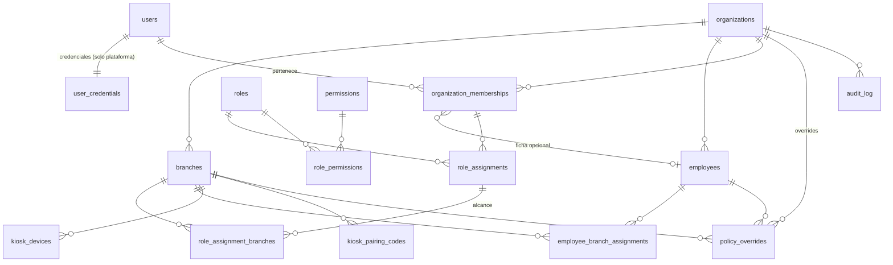

# 02 · Modelo de datos (PostgreSQL) — multi-negocio

> **Versión 1.0 — CONGELADA.** Deriva de `01-reglas-de-negocio.md`.
> Estado de implementación: **Fase 0 implementada** (esquemas `platform`, `auth`, `core`, `audit`; migraciones en `apps/api/db/migrations`). Las tablas de `scheduling` y `attendance` están **diseñadas** aquí y se crean en las fases 2–3.

## 1. Convenciones

- **Claves:** `uuid` (`gen_random_uuid()`). Sin enteros autoincrementales expuestos.
- **Tiempo:** todo instante es `timestamptz` y se guarda en **UTC**. Un invariante verificado en CI: no existe ninguna columna `timestamp without time zone`. Las fechas laborales son `date` calculadas con la zona efectiva de la sucursal.
- **Nada se borra:** FKs `ON DELETE RESTRICT`; el rol de la aplicación **no tiene `DELETE`** sobre tablas de negocio (excepción documentada: tablas puente de permisos/alcance).
- **Esquemas:** `platform`, `auth`, `core`, `audit` (Fase 0) · `scheduling`, `attendance` (fases 2–3) · futuros módulos con su propio esquema.
- **SQL es la fuente de verdad** (migraciones `.sql` versionadas). Drizzle ORM se usa para consultas tipadas; RLS, constraints, índices, triggers y exclusiones forman parte del diseño oficial en PostgreSQL.
- **Multi-tenant:** toda tabla de datos de negocio tiene `organization_id uuid NOT NULL`, `UNIQUE (organization_id, id)`, FKs **compuestas** hacia sus padres y **RLS habilitado y forzado** (§3).
- **Excepciones registradas** (no llevan `organization_id`): `core.permissions` (catálogo), `core.organizations` (es el tenant), `core.tenant_exempt_tables`, esquemas `platform` y `auth` (globales con protección propia), `public.schema_migrations`. Toda excepción está en `core.tenant_exempt_tables` con su motivo; **cualquier otra tabla sin protección rompe CI**.

## 2. Diagrama (Fase 0)


*Toda tabla de negocio cuelga además de `organizations` por `organization_id`. `platform.policy_defaults` (política de plataforma, singleton) y `platform.platform_audit_log` son globales.*

## 3. Aislamiento entre negocios

### 3.1 FKs compuestas
```sql
ALTER TABLE core.branches ADD CONSTRAINT branches_org_id_uk UNIQUE (organization_id, id);
-- en el hijo: la FK incluye organization_id ⇒ imposible apuntar a otro negocio
ALTER TABLE core.employee_branch_assignments
  ADD FOREIGN KEY (organization_id, branch_id) REFERENCES core.branches (organization_id, id);
```

### 3.2 RLS forzado
```sql
CREATE FUNCTION core.current_org() RETURNS uuid LANGUAGE sql STABLE AS
$$ SELECT nullif(current_setting('app.organization_id', true), '')::uuid $$;

SELECT core.enable_tenant_rls('core.branches');
-- = ENABLE + FORCE ROW LEVEL SECURITY + política:
--   USING (organization_id = core.current_org()) WITH CHECK (organization_id = core.current_org())
```
- Cada transacción de la API fija `set_config('app.organization_id', …, true)` (alcance de transacción: no se filtra entre peticiones del pool). **Sin contexto ⇒ 0 filas** (falla cerrado).
- `WITH CHECK` impide insertar o **mover** filas a otro negocio.

### 3.3 Roles de PostgreSQL
| Rol | Uso | Atributos |
|---|---|---|
| `migrator` | Dueño de los objetos; ejecuta migraciones | No superusuario, **sin `BYPASSRLS`** |
| `app_user` | La API | `NOSUPERUSER NOBYPASSRLS`; DML sin `DELETE` en negocio; sin `UPDATE`/`DELETE`/`TRUNCATE` en tablas solo-agregar |
| `platform_ops` | CLI de plataforma (alta de negocios, restablecer contraseñas) | `BYPASSRLS`; credenciales fuera de la API |
| `gate_owner` | Dueño de las funciones-puerta (`NOLOGIN`) | `BYPASSRLS`; privilegios mínimos |

Los roles los crea un script de **bootstrap** ejecutado una vez con superusuario.

### 3.4 Funciones-puerta (`SECURITY DEFINER`, dueño `gate_owner`, `search_path` fijo)
Necesarias porque ciertas búsquedas ocurren **antes** de conocer el negocio:
- `auth.resolve_kiosk_token(prefix)` → `(device_id, organization_id, branch_id, token_hash, status)`.
- `auth.redeem_pairing_code(code_hash, device_name, token_prefix, token_hash)` → crea el dispositivo (código de un solo uso).
- `auth.get_login_record(email)` → usuario + hash de contraseña + membresías activas (único camino a las credenciales).
- `core.list_active_organizations()` → ids, para procesos programados.

### 3.5 Verificación automática en CI
`core.tenant_isolation_violations()` revisa el catálogo y devuelve un renglón por violación:
- tabla con `organization_id` **sin** RLS habilitado, **sin** `FORCE`, **sin** política que use `core.current_org()`, o con `organization_id` nullable;
- tabla en un esquema de negocio **sin** `organization_id` que no esté en `core.tenant_exempt_tables`;
- columnas `timestamp without time zone`.

`pnpm check:tenancy` falla (exit ≠ 0) si hay violaciones; además una prueba demuestra que **una tabla multi-tenant nueva sin protección es detectada**.

## 4. Esquemas `platform` y `auth` (globales)

### `platform.policy_defaults` (singleton)
Política de **nivel plataforma**: una columna tipada por parámetro, todas `NOT NULL` (ver §6). Fila única (`id boolean PRIMARY KEY DEFAULT true CHECK (id)`).

### `platform.platform_audit_log` (solo-agregar)
Operaciones de plataforma: alta/suspensión de negocio, restablecimiento de contraseñas, alta de usuarios. `id`, `occurred_at`, `actor`, `action`, `organization_id` (nullable, sin FK para no bloquear), `details` jsonb.

### `auth.users` (identidad global)
`id`, `email` (único, minúsculas), `display_name`, `status` (`ACTIVE`/`DISABLED`; lo gestiona la plataforma), `created_at`, `updated_at`.
**RLS especial:** un usuario es visible solo si es miembro del negocio activo (`EXISTS` en `organization_memberships`) o es el usuario de la sesión. El administrador de un negocio **no ve a usuarios de otros negocios**.

### `auth.user_credentials`
`user_id` (PK), `password_hash` (argon2id), `password_changed_at`, `failed_attempts`, `locked_until`.
**`app_user` no tiene ningún privilegio sobre esta tabla.** La API accede solo vía funciones-puerta; un administrador de negocio no puede leer ni cambiar la contraseña global. El restablecimiento lo hace `platform_ops` (CLI). *(Recuperación por correo: fase posterior; el modelo ya separa credenciales.)*

## 5. Esquema `core`

### `core.organizations` (el tenant)
`id` (= `organization_id` en todo el sistema), `slug` (único), `name`, **`timezone` NOT NULL** (IANA, sin default; validada por trigger contra `pg_timezone_names`), `branding` jsonb, `status` (`ACTIVE`/`SUSPENDED`), `created_at`, `updated_at`.
RLS: `id = core.current_org()`. `app_user`: `SELECT` y `UPDATE (name, branding, timezone)`; crear negocios solo `platform_ops`. Fatboy: `timezone = 'America/Tijuana'`.

### `core.branches`
`id`, `organization_id`, `code`, `name`, **`timezone` NULL** (hereda del negocio; si se define, la sobrescribe; validada igual), `is_active`. `UNIQUE (organization_id, code)`, `UNIQUE (organization_id, id)`.
Zona efectiva = `COALESCE(branches.timezone, organizations.timezone)`.

### `core.employees`
`id`, `organization_id`, `employee_number` (`UNIQUE (organization_id, employee_number)`), `first_name`, `last_name`, `phone`, `notes`, `status` (`ACTIVE`/`INACTIVE`), `hired_at`, `terminated_at`, `termination_reason`, `pin_hash`, `pin_set_at`.
```sql
-- PIN único entre ACTIVOS del mismo negocio (el mismo PIN en otro negocio es válido)
CREATE UNIQUE INDEX employees_pin_unique ON core.employees (organization_id, pin_hash)
  WHERE status = 'ACTIVE' AND pin_hash IS NOT NULL;
CHECK (status = 'ACTIVE' OR pin_hash IS NULL)   -- la baja invalida el PIN
```
`pin_hash = HMAC-SHA256(PEPPER, organization_id ‖ ':' ‖ pin)` en hex. **Nunca el PIN.** El *pepper* vive fuera de la BD; al mezclar `organization_id`, dos negocios con el mismo PIN producen hashes distintos. Restablecer = sobrescribir `pin_hash` (el anterior deja de funcionar al instante).

### `core.employee_branch_assignments`
`id`, `organization_id`, `employee_id`, `branch_id`, `kind` (`PRIMARY`/`TEMPORARY`), `valid_from`, `valid_to`, `reason`, `created_by`. FKs compuestas.
```sql
EXCLUDE USING gist (employee_id WITH =, daterange(valid_from, valid_to, '[]') WITH &&) WHERE (kind = 'PRIMARY')
CHECK (valid_to IS NULL OR valid_to >= valid_from)
```

### Membresías, roles y alcance
- **`core.organization_memberships`**: `id`, `organization_id`, `user_id` → `auth.users`, `employee_id` (nullable: **ficha opcional**), `status` (`ACTIVE`/`INACTIVE`/`REMOVED`). `UNIQUE (organization_id, user_id)`; `UNIQUE (organization_id, employee_id) WHERE employee_id IS NOT NULL`. Política adicional de **solo lectura**: `user_id = core.current_user_id()` (el usuario lista sus propios negocios al iniciar sesión).
- **`core.permissions`** *(global)*: `code` PK, `description`. Catálogo sembrado.
- **`core.roles`**: `id`, `organization_id`, `name`, `is_system`. Se siembran `ADMIN` y `ENCARGADO` al crear el negocio.
- **`core.role_permissions`**: `organization_id`, `role_id`, `permission_code`.
- **`core.role_assignments`**: `id`, `organization_id`, `membership_id`, `role_id`, `scope` (`ORGANIZATION` / `BRANCHES`).
- **`core.role_assignment_branches`**: `organization_id`, `assignment_id`, `branch_id`. Con `scope = 'BRANCHES'` exige ≥ 1 fila (validado en servicio).

Un usuario con varias sucursales = **una cuenta, una membresía, una asignación con varias filas de alcance**.

### `core.kiosk_devices` y `core.kiosk_pairing_codes`
- `kiosk_devices`: `id` (= `device_id`), `organization_id`, `branch_id`, `name`, `token_prefix` (único global), `token_hash` (SHA-256 del secreto; nunca el token), `status` (`ACTIVE`/`REVOKED`), `last_seen_at`, `revoked_at`. **El token pertenece a `organization_id + branch_id + device_id`.**
- `kiosk_pairing_codes`: `id`, `organization_id`, `branch_id`, `code_hash`, `expires_at`, `used_at`, `created_by`. Un solo uso, vencimiento corto.

### `core.pin_attempts`
`id`, `organization_id`, `device_id`, `attempted_at`, `success`, `employee_id` (null si falló). Alimenta el bloqueo `pin_max_attempts`/`pin_lockout_sec`. **No guarda el PIN intentado.**

### `core.policy_overrides` (D-20: solo overrides)
`id`, `organization_id`, `scope` (`ORGANIZATION`/`BRANCH`/`EMPLOYEE`), `branch_id`, `employee_id`, **una columna tipada por parámetro, todas nullable** (`NULL` = hereda), `updated_by`, `created_at`, `updated_at`.
```sql
CHECK ((scope='ORGANIZATION' AND branch_id IS NULL AND employee_id IS NULL)
    OR (scope='BRANCH'       AND branch_id IS NOT NULL AND employee_id IS NULL)
    OR (scope='EMPLOYEE'     AND employee_id IS NOT NULL AND branch_id IS NULL))
-- niveles permitidos por parámetro, p. ej. no se puede sobrescribir por empleado:
CHECK (scope <> 'EMPLOYEE' OR (early_entry_window_min IS NULL AND absent_after_min IS NULL
       AND operational_cutoff IS NULL AND max_hours_unscheduled IS NULL AND debounce_sec IS NULL
       AND pin_max_attempts IS NULL AND pin_lockout_sec IS NULL AND week_start_day IS NULL))
CHECK (scope = 'ORGANIZATION' OR week_start_day IS NULL)
-- un override por nivel:
UNIQUE (organization_id) WHERE scope='ORGANIZATION'
UNIQUE (organization_id, branch_id) WHERE scope='BRANCH'
UNIQUE (organization_id, employee_id) WHERE scope='EMPLOYEE'
```
Más rangos por parámetro (`CHECK (break_allowed_min BETWEEN 0 AND 600)`, `week_start_day BETWEEN 1 AND 7`, etc.).

**Política efectiva** (`resolveEffectivePolicy`, función pura con pruebas): `plataforma → ORGANIZATION → BRANCH → EMPLOYEE`, campo por campo (`COALESCE` en orden inverso). Ejemplo: plataforma 35 · Fatboy (sin override) 35 · San Marcos 35 · Venecia 40 · empleado X (override 30) ⇒ efectivo de X = 30.

Parámetros: `entry_tolerance_min`, `exit_tolerance_min`, `max_breaks`, `break_allowed_min`, `break_tolerance_min`, `require_break`, `early_entry_window_min`, `absent_after_min`, `operational_cutoff`, `max_hours_unscheduled`, `debounce_sec`, `pin_max_attempts`, `pin_lockout_sec`, `week_start_day` (tabla de defaults y niveles en `01 §10`).

## 6. Esquema `audit`

### `audit.audit_log` (solo-agregar, por negocio)
`id` (bigint identity), `organization_id` NOT NULL, `branch_id` (nullable: solo si la acción pertenece a una sucursal), `occurred_at`, `actor_type` (`USER`/`SYSTEM`/`KIOSK`), `actor_user_id`, `actor_device_id`, `action`, `entity_type`, `entity_id`, `before` jsonb, `after` jsonb, `reason`, `ip`, `request_id`.
- RLS por negocio; `INSERT` solo con su contexto (`WITH CHECK`).
- Se inserta **en la misma transacción** del cambio auditado.
- Trigger que rechaza `UPDATE`/`DELETE`/`TRUNCATE` + `REVOKE` para `app_user`.
- **Nunca** contiene PIN, hash de PIN, contraseñas ni tokens (el servicio redacta campos sensibles y hay pruebas).

## 7. Esquema `scheduling` (Fase 2 — diseño)

Todas con `organization_id`, FKs compuestas y RLS.
- **`shift_templates`**: `branch_id` (null = todo el negocio), `name`, `start_time`, `end_time`.
- **`weekly_schedules`**: `branch_id`, `week_start`, `status` (`DRAFT`/`PUBLISHED`), `published_at/by`. `UNIQUE (organization_id, branch_id, week_start)`.
- **`shifts`**: `schedule_id`, `employee_id`, `branch_id`, `business_date`, `start_local`, `end_local`, `starts_at`, `ends_at` (timestamptz calculados con la zona efectiva; si `end_local <= start_local`, `ends_at` cae al día siguiente), `template_id`, `status`.
```sql
EXCLUDE USING gist (employee_id WITH =, tstzrange(starts_at, ends_at, '[)') WITH &&) WHERE (status='SCHEDULED')
CHECK (ends_at > starts_at)
```

## 8. Esquema `attendance` (Fase 3 — diseño)

Todas con `organization_id`, FKs compuestas y RLS.

### `attendance_records` — la jornada
`id`, `employee_id`, `branch_id` (donde se trabajó), `shift_id` (nullable), `business_date`, `state` (`WORKING`/`ON_BREAK`/`CLOSED`/`REVIEW`/`ABSENT`), `scheduled_start/end` (snapshot), `review_due_at`, `actual_in`, `actual_out` (**vacío si nadie registró salida; nunca se inventa**), `entry_delta_minutes` (con signo, siempre), `entry_status` (`ON_TIME`/`LATE`/`NONE`), `late_minutes` (= delta real completo si `LATE`), `exit_status`, `early_leave_minutes`, `scheduled_minutes`, `worked_minutes` (`NULL` si incompleta; **sin** descontar pausas), **`breaks_total_minutes`**, **`breaks_exceeded_minutes`** (acumulados de la jornada), `policy_snapshot` jsonb, `computed_at`, `version`.
```sql
UNIQUE (employee_id) WHERE state IN ('WORKING','ON_BREAK')   -- una jornada abierta por empleado
UNIQUE (shift_id) WHERE shift_id IS NOT NULL
```

### `attendance_breaks` — pausas/comidas como registros independientes (D-14)
`id`, `organization_id`, `attendance_record_id`, `sequence` (1, 2, …), `started_event_id`, `ended_event_id` (nullable mientras está abierta), `started_at`, `ended_at`, `status` (`OPEN`/`CLOSED`), **`duration_minutes`**, **`allowed_minutes`** (snapshot de la política), **`exceeded_minutes`**.
`UNIQUE (attendance_record_id, sequence)`; una sola pausa abierta por jornada. Es una **proyección** recalculable. El máximo (`max_breaks`) sale de la política, no del modelo: pasar de 1 a 2 pausas no requiere migración.

### `punch_events` — checadas (INMUTABLES, preparadas para offline — D-12)
| Columna | Notas |
|---|---|
| `id`, `organization_id`, `attendance_record_id`, `employee_id`, `branch_id` | |
| `type` | `IN`/`OUT`/`BREAK_START`/`BREAK_END` |
| **`client_event_id`** | `uuid` generado por el cliente (idempotencia) |
| **`device_id`** | kiosco; nulo si `source = CORRECTION` |
| **`occurred_at`** | cuándo ocurrió el evento. Online = hora del servidor |
| **`received_at`** | cuándo lo recibió el servidor (`now()`) |
| **`source`** | `KIOSK_ONLINE` / `KIOSK_OFFLINE_SYNC` / `CORRECTION` |
| `time_source` | `SERVER` / `DEVICE` (offline: hora del dispositivo, marcada para revisión) |
| `correction_id` | si vino de una corrección |
```sql
UNIQUE (organization_id, device_id, client_event_id)   -- reenviar no duplica
-- trigger forbid_mutation + REVOKE UPDATE, DELETE
```
`punch_event_voids` (anulaciones, solo-agregar) y la vista `effective_punch_events` (`security_invoker = true`, respeta RLS) permiten corregir sin tocar la original.

### `attendance_corrections` / `correction_lines` / `incidents`
- **Correcciones**: cabecera con `reason NOT NULL`, solicitante, decisión; líneas `ADD`/`VOID` con valores anterior y nuevo. Reglas de autorización (alcance por sucursal donde ocurrió la jornada, **no corregir la propia**, administrador solo dentro de su negocio) en el backend con pruebas; aislamiento entre negocios por RLS.
- **Incidencias**: `type` (ver RN-INC-01), `status`, `resolution`, `details` jsonb; `UNIQUE (attendance_record_id, type)`.

## 9. Casos difíciles

| Caso | Resolución |
|---|---|
| Fuga entre negocios | RLS forzado + FKs compuestas + rol sin `BYPASSRLS` + contexto obligatorio + CI |
| Zona horaria | UTC en BD; negocio con zona obligatoria; sucursal hereda o sobrescribe |
| Turno 7 PM → 3 AM | Turno guarda instantes reales; Salida va a la jornada abierta; `business_date` = día de inicio |
| Olvido de salida | `review_due_at` ⇒ `REVIEW` + incidencia; nada se inventa |
| Retardo 7:12 vs 7:00 (tol. 10) | delta 12, `LATE`, `late_minutes = 12`, incidencia; 7:08 ⇒ delta 8, `ON_TIME`, sin incidencia |
| Dos pausas el día de mañana | Filas en `attendance_breaks`; `max_breaks = 2` en política; sin migración |
| Offline futuro | `client_event_id` + `device_id` + `occurred_at`/`received_at` + `source`; el reenvío es idempotente |
| Misma persona en dos negocios | Una fila en `auth.users`, dos membresías |
| Administrador intenta cambiar contraseña global | Sin privilegios sobre `auth.user_credentials` |
| Mismo PIN en dos negocios | Permitido (único por negocio; el hash incluye `organization_id`) |
| Política de empleado | Solo el override; efectivo calculado |
| Baja de empleado | `INACTIVE`, `pin_hash = NULL` (CHECK), historial intacto |

## 10. Procesos programados (fases 3+)

Cada minuto, con candado de Postgres, por cada negocio de `core.list_active_organizations()` en **su propio contexto** (RLS activo): marcar jornadas con `review_due_at <= now()` como `REVIEW`; crear `ABSENT` + `FALTA` para turnos terminados sin Entrada; detectar pausas abiertas excesivas.

## 11. Volumen

~50 empleados × 2–4 checadas/día ≈ 70 mil filas/año por negocio pequeño. Todos los índices empiezan por `organization_id`. Un negocio muy grande podría moverse a su propia base sin cambiar el modelo.
